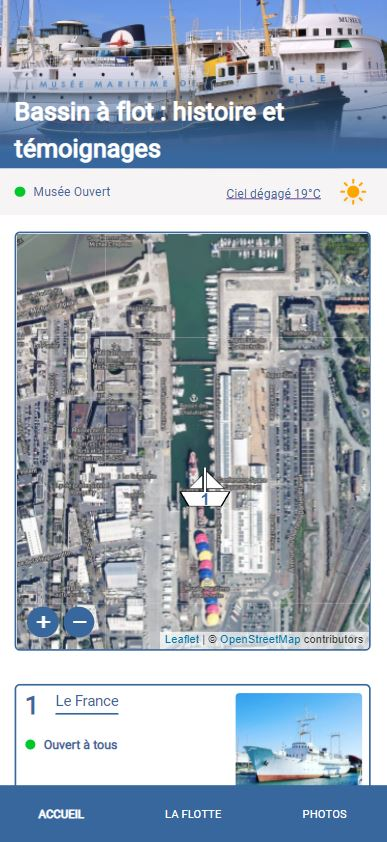
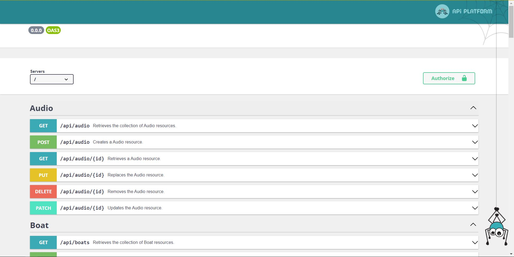
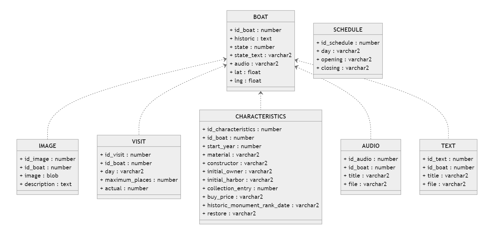

# Musee maritime
Dans ce projet nous allons créer un site web pour le musée maritime de la Rochelle.    
Le but étant de pouvoir afficher les différents bateaux du musée, leurs détails, photos, ...

Voici un example de la page d'accueil


## Fonctionnement du projet

Le projet repose sur une stack docker, composée de trois conteneurs:

- **front**: contient le frontend de l'application codé en react.js
- **sfapi**: contient l'api réalisé à l'aide symfony et api platform
- **mysql**: contient la base de données de l'application

Le conteneur front intérargi avec l'api sfapi pour récupérer les données de la base de données mysql.

## Lancement du projet

Pour lancer la stack docker, il suffit de lancer le script `docker-compose.yml`
Pour cela :

```
docker compose up --build
```

Les conteneurs sont disponibles à l'adresse suivante :

- **front** : http://localhost:3000
- **sfapi** : http://localhost:8000
- **mysql** : http://localhost:3306

Pour lancer le frontend indépendamment de la stack docker :

```
cd front && yarn start
```

## Déroulement du projet
### DevOps
Pour le bon déroulement du projet, nous avons mis en place un certain nombres de règles de gestion (Devops).
Elles sont toutes accessibles à l'adressse suivante :
[Wiki : Conventions du projet](https://forge.iut-larochelle.fr/mhacala/2021-2022-info2-dw-projet-musee-maritime-z2-1/-/wikis/D%C3%A9finition-des-conventions)

De plus un script python à été crée pour les tests de nommage des commits.

### Architecture && Conception
Toutes les US (Users Stories) réalisés ainsi que les diagrammes de classes et découpages en composants sont disponibles sur le [wiki](https://forge.iut-larochelle.fr/mhacala/2021-2022-info2-dw-projet-musee-maritime-z2-1/-/wikis/Spec-Conception) du projet.

### Base de donnée && Api
Voici un exemple du [site](http://localhost:8000/api) de la doc de l'api.


Les schémas de base de donnée sont disponibles à l'adresse suivante :
[Wiki : base de donnée](https://forge.iut-larochelle.fr/mhacala/2021-2022-info2-dw-projet-musee-maritime-z2-1/-/wikis/Ressources-BD)




## Contributeurs
 - Amélien Bernard
 - Mayonobe Hugo
 - David Arthur
 - Hacala Maude
 - Huort Louis
